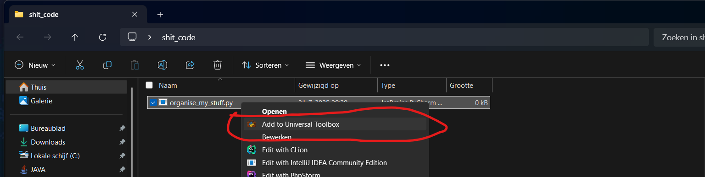
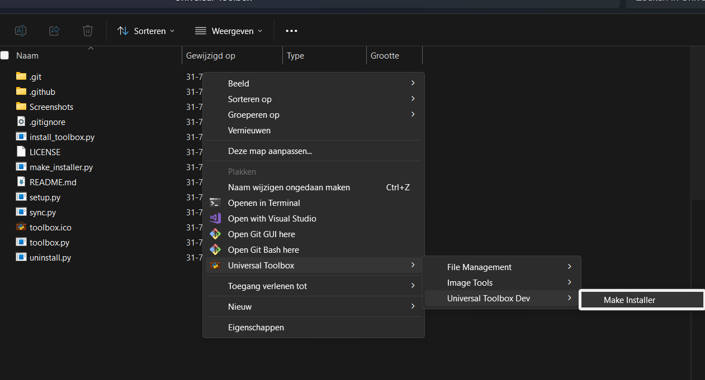
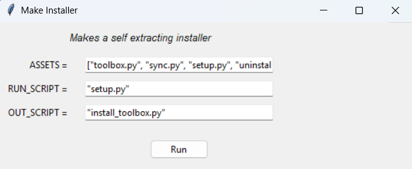

# 🧰 Universal Toolbox

*The glorified graveyard for your throwaway Python trash that somehow keeps saving your ass.*

---

## 🚀 What is this?

You know those quick Python scripts you duct-tape together in 3 minutes to rename files, batch-edit something, or extract the pain from your soul?
No time for structure, no time to setup a virtual environment, just one file of shit code.

Yeah, this is a toolbox to collect exactly those pieces of shitty python. It's a great way to give your scripts the life they barely still deserve and to reuse them in the future, imagine about actually reusing them or just growing your ego on the amount of shit code you now own.
This tool is just as *quickly thrown together* as the scripts it's made to manage. No shame. It works. That’s good enough.

It also lives nice and conveniently inside your Windows Explorer's or desktop's context menu. No app, no nothing.. It's always right there, where you need it.

---

## 💾 How to Install

Find the installer in the **[Releases](../../releases)** section.
Download it. Run it with Python. Pray. You're set.

---

## 🛠️ How to Use It

### 🧪 Add a Script to the Toolbox

1. Write your beautiful, horrific little `.py` script.
2. Right-click it in your Desktop or whatever place you're trashing with it in Windows Explorer.
3. Select **“Add to Toolbox”**. (in windows 11, it's under 'Show more options')
4. Fill in a name, category, and a one-sentence apology description to bless the clueless future you.
5. That’s it. It's in.

### 🔁 Run a Script from the Toolbox

1. Right-click **any empty space** in a folder or your desktop.
2. Choose **“Universal Toolbox”** from the context menu.
3. Browse your beautifully chaotic collection of tools.
4. When you pick one:

   * A GUI will pop up that **magically detects your ALL\_CAPS global variables**. (cuz be real. All your shit code runs on this config convention)
   * You can customize these before running, unless you just want to use the hardcoded path you used 3 months ago when you made the tool.
   * You know, like `INPUT_DIR = "C:/Some/Jank"` — yeah, *those*.

🧭 **Everything runs relative to where you right-clicked**.
So if your script writes files, reads paths, or destroys the universe — it does it *right there*.

### 📂 Exporting or Sharing a tool
1. Right-click **any empty space** in a folder or your desktop.
2. Choose **“Universal Toolbox”->Export/Share Tools”** from the context menu.
3. Follow the instructions on the popup window
4. This will save a python file with the tool name and description embedded inside it, so you can keep this information when re-adding or sharing it.

### 🗑️ Removing a tool
1. Right-click **any empty space** in a folder or your desktop.
2. Choose **“Universal Toolbox”->Delete Tools** from the context menu.
3. Follow the instructions on the popup window
4. Your tool is now permanently voided into the abyss. If the category has no remaining tools inside, it will be deleted too.

---

## 🐍 Requirements

* Python installed
* No virtual environment, cuz you didn't make one when creating your tools anyway
* Sanity optional
* Your scripts don’t need any SDK, wrapper, or even decency. Just global ALL\_CAPS config vars.

---

## 👎 No Promises

* There’s no structure.
* There’s no cleanup.
* There’s no undo.
* And there are **no regrets**.

Isn't it perfect?

---

## 🔥 How to UnInstall

1. Right-click **any empty space** in a folder or your desktop.
2. Choose **“Universal Toolbox” -> “Open Install Directory”** from the context menu.
3. This will open a folder in your Windows Explorer, where you will find `uninstall.py`
4. Run it in a terminal with admin permissions enabled.
5. Double check:
   - In your Windows Registry Editor:
     - There should be no `UniversalToolbox` inside `HKEY_CLASSES_ROOT\Directory\Background\shell`
     (this one tends skip deleting some subkeys sometimes)
     - There should be no `UniversalToolbox` inside
     `HKEY_CLASSES_ROOT\SystemFileAssociations\.py\shell`

---

---

## 📸 Screenshots
Adding a new tool:

Browsing your toolbox:

Launching your tool:
